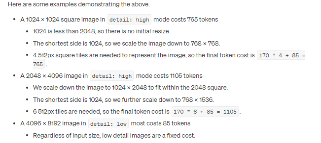

> Lastest Update: 9th May 2024&nbsp

## intruduction
带视觉的GPT-4 Turbo允许模型接收图像并回答有关图像的问题。从之前的模型看，语言模型系统由于只接受单一的输入模态(文本)而受到限制。对于许多用例来说，这限制了GPT-4等模型的使用范围。以前，该模型在API中有时被称为GPT-4V或gpt-4-vision-preview。请注意，Assistants  API目前不支持图像输入。
## Quick start

图像主要通过两种方式提供给模型:
1. 通过传递图像的链接，或者
2. 在请求中直接传递base64编码的图像。

图像可以在user, system and assistant messages中传递。目前，我们不支持在第一个系统消息中传递图像，但未来可能会改变。

```
from openai import OpenAI

client = OpenAI()

response = client.chat.completions.create(
  model="gpt-4-turbo",
  messages=[
    {
      "role": "user",
      "content": [
        {"type": "text", "text": "What’s in this image?"},
        {
          "type": "image_url",
          "image_url": {
            "url": "https://upload.wikimedia.org/wikipedia/commons/thumb/d/dd/Gfp-wisconsin-madison-the-nature-boardwalk.jpg/2560px-Gfp-wisconsin-madison-the-nature-boardwalk.jpg",
          },
        },
      ],
    }
  ],
  max_tokens=300,
)

print(response.choices[0])
```

该模型最擅长回答关于图像中存在什么的一般性问题。虽然它确实理解图像中物体之间的关系，但它还没有优化以回答关于图像中某些物体位置的详细问题。例如，你可以问它一辆汽车是什么颜色，或者根据你冰箱里的东西对晚餐有什么想法，但如果你给它看一个房间的图像，并问它椅子在哪里，它可能不会正确回答问题。

重要的是，在探索可视化理解可以应用于哪些用例时，请记住模型的局限性。

## 上传base64编码图像-Uploading base 64 encoded images
如果您在本地有一个图像或一组图像，您可以将它们以base 64编码格式传递给模型，以下是一个具体的示例:

```
import base64
import requests

# OpenAI API Key
api_key = "YOUR_OPENAI_API_KEY"

# Function to encode the image
def encode_image(image_path):
  with open(image_path, "rb") as image_file:
    return base64.b64encode(image_file.read()).decode('utf-8')

# Path to your image
image_path = "path_to_your_image.jpg"

# Getting the base64 string
base64_image = encode_image(image_path)

headers = {
  "Content-Type": "application/json",
  "Authorization": f"Bearer {api_key}"
}

payload = {
  "model": "gpt-4-turbo",
  "messages": [
    {
      "role": "user",
      "content": [
        {
          "type": "text",
          "text": "What’s in this image?"
        },
        {
          "type": "image_url",
          "image_url": {
            "url": f"data:image/jpeg;base64,{base64_image}"
          }
        }
      ]
    }
  ],
  "max_tokens": 300
}

response = requests.post("https://api.openai.com/v1/chat/completions", headers=headers, json=payload)

print(response.json())
```

## 多个图像输入-Multiple image inputs
Chat Completions API能够接收并处理base64编码格式或图像URL格式的多个图像输入。该模型将处理每个图像，并使用来自所有图像的信息来回答问题。
```
from openai import OpenAI

client = OpenAI()
response = client.chat.completions.create(
  model="gpt-4-turbo",
  messages=[
    {
      "role": "user",
      "content": [
        {
          "type": "text",
          "text": "What are in these images? Is there any difference between them?",
        },
        {
          "type": "image_url",
          "image_url": {
            "url": "https://upload.wikimedia.org/wikipedia/commons/thumb/d/dd/Gfp-wisconsin-madison-the-nature-boardwalk.jpg/2560px-Gfp-wisconsin-madison-the-nature-boardwalk.jpg",
          },
        },
        {
          "type": "image_url",
          "image_url": {
            "url": "https://upload.wikimedia.org/wikipedia/commons/thumb/d/dd/Gfp-wisconsin-madison-the-nature-boardwalk.jpg/2560px-Gfp-wisconsin-madison-the-nature-boardwalk.jpg",
          },
        },
      ],
    }
  ],
  max_tokens=300,
)
print(response.choices[0])
```

## 低保真或高保真图像理解-Low or high fidelity image understanding
通过控制detail 参数，它有三个选项，low、high或auto，您可以控制模型如何处理图像并生成其文本理解。默认情况下，模型将使用自动设置，该设置将查看图像输入大小并决定是否使用低设置或高设置。

- Low将启用“低分辨率”模式。该模型将接收一个低分辨率512px x 512px版本的图像，并用65个预算的token表示图像。对于不需要高细节的用例，这允许API返回更快的响应并消耗更少的输入token。
- High将启用“高分辨率”模式，该模式首先允许模型看到低分辨率图像，然后根据输入图像大小创建输入图像的详细裁剪，为512px正方形。每个裁剪片段使用两倍的token预算(65个token)，总共129个代币。
  
```
from openai import OpenAI

client = OpenAI()

response = client.chat.completions.create(
  model="gpt-4-turbo",
  messages=[
    {
      "role": "user",
      "content": [
        {"type": "text", "text": "What’s in this image?"},
        {
          "type": "image_url",
          "image_url": {
            "url": "https://upload.wikimedia.org/wikipedia/commons/thumb/d/dd/Gfp-wisconsin-madison-the-nature-boardwalk.jpg/2560px-Gfp-wisconsin-madison-the-nature-boardwalk.jpg",
            "detail": "high"
          },
        },
      ],
    }
  ],
  max_tokens=300,
)

print(response.choices[0].message.content)
```
## Managing images-管理图像

与Assistants API不同，Chat Completions API不是stateful。这意味着您必须自己管理传递给模型的消息(包括图像)。如果您想多次将相同的图像传递给模型，则必须在每次向API发出请求时传递图像。

对于长时间运行的对话，我们建议通过URL而不是base64传递图像。模型的延迟也可以通过提前将图像缩小到小于期望的最大尺寸来改善。对于低分辨率模式，我们期望得到512px x 512px的图像。对于高分辨率模式，图像的短边应该小于768px，长边应该小于2000 px。

在图像被模型处理后，它会从OpenAI服务器上删除，不再保留。我们不会使用通过OpenAI API上传的数据来训练我们的模型。

## Limitations

虽然具有视觉功能的GPT-4功能强大，可以在许多情况下使用，但重要的是要了解模型的局限性。以下是我们知道的一些限制:

医学图像:该模型不适合解释CT扫描等专业医学图像，不应用于医学建议。
非英语:在处理包含非拉丁字母(如日语或韩语)文本的图像时，模型可能无法获得最佳性能。
小文本:放大图像内的文本以提高可读性，但避免裁剪重要的细节。
旋转:模型可能会误解旋转/颠倒的文本或图像。
视觉元素:模型可能很难理解颜色或样式不同的图形或文本，如实线、虚线或虚线。
空间推理:模型很难处理需要精确空间定位的任务，如识别国际象棋位置。
准确性:在某些情况下，模型可能会生成不正确的描述或标题。
图像形状:模型很难处理全景图像和鱼眼图像。
元数据和调整大小:模型不处理原始文件名或元数据，图像在分析之前会调整大小，影响其原始尺寸。
计数:可以给出图像中物体的近似计数。
验证码:出于安全原因，我们已经实现了一个系统来阻止提交验证码。

## Calculating costs
与文本输入一样，图像输入也以token计量和收费。给定图像的token成本由两个因素决定:图像的大小和每个image_url block上的detail选项。所有detail: low的图像低成本每个85 tokens。detail: high的图像首先缩放以适应2048 x 2048的正方形，保持其宽高比。然后，它们被缩放，使图像的最短边是768px长。最后，我们计算图像由多少个512px的正方形组成。每个正方形需要170个token。另外85个token是被添加到最终总数中。


## FAQ
常见问题解答
我可以微调gpt-4中的图像功能吗?
不，我们目前不支持微调gpt-4的图像功能。

我可以使用gpt-4来生成图像吗?
不，你可以使用dall-e-3来生成图像，使用gpt-4-turbo来理解图像。

我可以上传什么类型的文件?
我们目前支持PNG (. PNG)、JPEG (. JPEG和。jpg)、WEBP (. WEBP)和非动画GIF (. GIF)。

我可以上传的图片大小有限制吗?
是的，我们将每张图片的上传限制为20MB。

我可以删除我上传的图片吗?
不，我们会在模型处理后自动为您删除图像。

我在哪里可以了解更多关于使用Vision的GPT-4的考虑因素?
您可以在GPT-4 with Vision system card中找到有关我们评估、准备和缓解工作的详细信息。

我们进一步实现了一个系统来阻止验证码的提交。

如何对视觉GPT-4进行速率限制?
我们在token级别处理图像，因此我们处理的每个图像都计入每分钟token(TPM)限制。有关用于确定每张图像token数量的公式的详细信息，请参见计算成本一节。

带视觉的GPT-4能理解图像元数据吗?
不，模型不接收图像元数据。

What happens if my image is unclear?
如果图像是模糊的或不清晰的，模型将尽力解释它。然而，结果可能不那么准确。一个好的经验法则是，如果普通人在低/高分辨率模式下无法看到图像中的信息，那么模型也不能。
